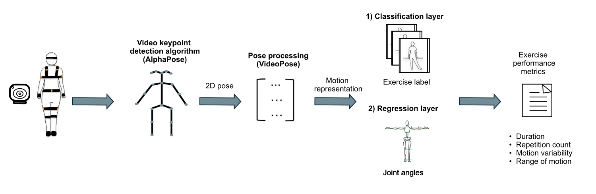

# Deep learning-based physical exercise assessment of older adults using single-camera videos



## Overview
This repository contains the code used in the paper:

Stefanova, V., Maeyens, E., Brughmans, J., Vargemidis, D., Lebleu, J., Stulens, L., ... & Vanrumste, B. (2025). [Deep learning-based physical exercise assessment of older adults using single-camera videos.](https://www.medrxiv.org/content/10.1101/2025.08.30.25334353.abstract) medRxiv, 2025-08.

The goal of this work is to enable **automatic monitoring of physical exercise performance** in older adults using a single RGB camera. The proposed framework:

- Recognizes fine-grained exercise actions (classification)
- Estimates joint angles with 3 rotational degrees of freedom (regression)
- Computes exercise performance metrics (EPMs)

These metrics include:
- Duration  
- Repetition count  
- Range of motion  
- Motion variability  
---

## Dataset

The dataset used in this study includes:
- Normalized 2D pose sequences
- 3D joint angles (IMU-based ground truth)
- Frame-level exercise labels
---

## Notes

This repository assumes:

- 2D poses have already been extracted using AlphaPose
- Raw video processing is not included in this repository

Input format:
- Shape: `(T × 17 × 3)` → (x, y, confidence)
- Normalized to the range `[-1, 1]`

---

## Quick start
Make sure you have Python 3+ and torch installed. To train and evaluate the model on a specific subject and task, run:

```bash
python run.py --split 0 --experiment videopose --test_subject sub01 --task classification
````

`--split` refers to the LOSO-CV split index and it will be included in the resulting file names. Each aplsit corresponds to one subject used as the test set (`--test_subject`) while the remaining subjects are used for training. 

`--task` can be either `regression` or `classifciation` depending on the learning objective.


For evaluating the model's performance on the two tasks and generating the performance plots, run the cells in `videopose_eval.ipynb`.

For computing the exercise performance metrics, run the cells in `exercise_metrics.ipynb`.

## License
This repository includes code adapted from Dario Pavllo, et al. [3D human pose estimation in video with temporal convolutions and semi-supervised training.](https://github.com/facebookresearch/VideoPose3D) (CVPR), 2019., licensed under CC BY-NC 4.0.

This project is therefore also distributed under CC BY-NC 4.0 and is intended for non-commercial research use only.